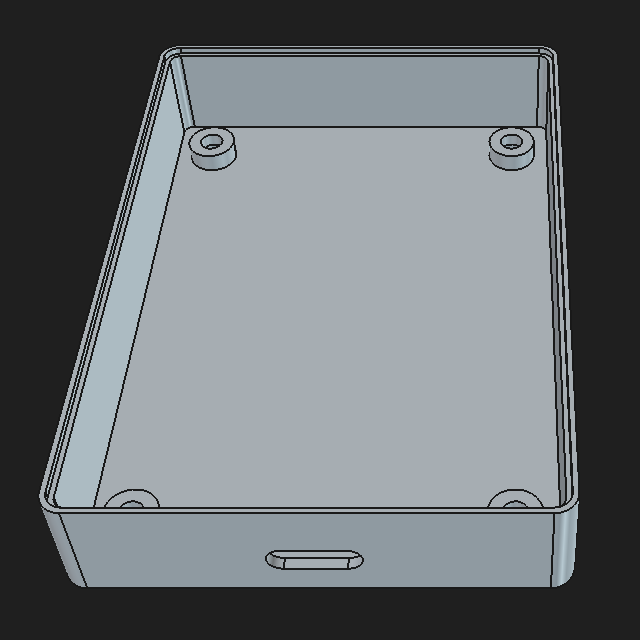
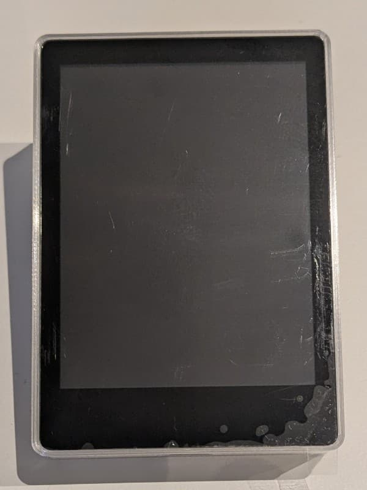
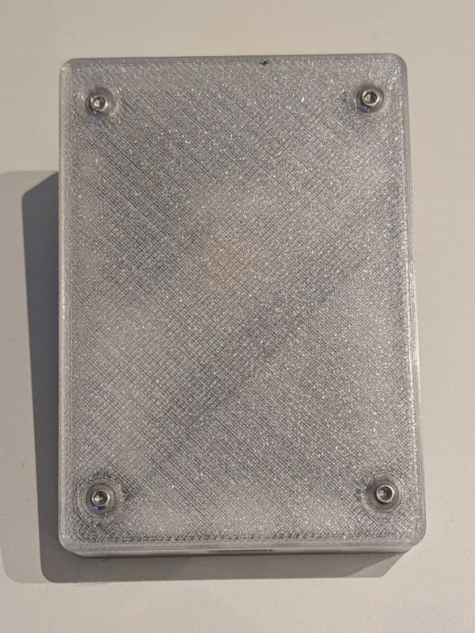

## Waveshare RP2350 Touch 2.8 Inch LCD Case

Designed to be used as a case for [RS-Key](https://github.com/TheMaxMur/RS-Key),
hence no button cutouts on the right side.

**License:** CC-BY-NC-SA 4.0

### Materials

Print in PLA or PETG.
Requires 4x M2.5 x 5mm screws for assembly.

### Alternatives

[Waveshare RP2350 2.8 inch case by cofob on MakerWorld (with buttons)](https://makerworld.com/en/models/3204749-waveshare-rp2350-2-8inch-case)

### Images

